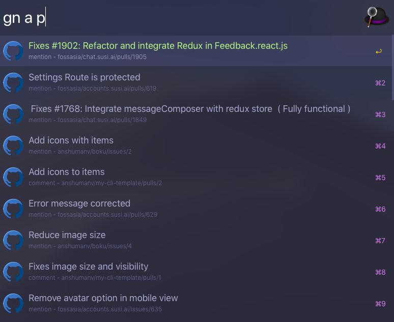

<p align="center">

</p>

<h1 align="center"> alfred-github-notifications </h1>
<p align="center">
  
  
  
</p>


<p align="center">Alfred workflow to fetch your github notifications.</p>


## Demo




## Install

```
$ npm install --global alfred-github-notifications
```

*Requires [Node.js](https://nodejs.org) 4+ and the Alfred [Powerpack](https://www.alfredapp.com/powerpack/).*


## Configuration

### Generate GitHub token

1. Create a new personal access token with notification access [here](https://github.com/settings/tokens/new).
2. Add description and click on genreate.
3. Click **copy**.


### Register environment variables through Alfred

1. Open Alfred Preferences.
2. Go to the Workflows tab.
3. Select **github-notifications**.
4. Open the variables panel by clicking the `Configure workflow and variables` [+] button on the right.
5. Fill the values
    - `access_token` : Previously copied GitHub token
6. Save


## Usage

In Alfred, type `gn` to display notifications.

Optional params - 

* a - Show notifications marked a read
* p - Show notifications in which you were directly mentioned or participated.


## Author

[Anshuman Verma](https://github.com/anshumanv)

[](https://twitter.com/Anshumaniac12)
[](https://linkedin.com/in/anshumanv12)
[](https://www.facebook.com/anshumanv12)
[](https://www.paypal.me/anshumanverma)
